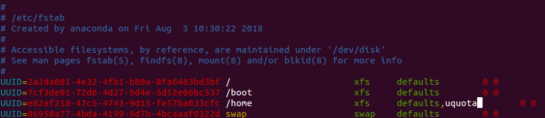

Mult-User CentOS 7 Environment for Software Carpentry
=====================================================

The motivation for this setup is to have a Software Carpentry environment
ready to go and available as a backup to support learners who are unprepared
and won't be able to get setup in a reasonable amount of time. (This happens
a lot with not-so-old-but-already-unsupported macOS systems.)

The setup procedure presented here begins with a minimal CentOS 7 
installation, installs the software needed for core Software Carpentry 
lessons, configures a minimal desktop environment (built around 
[IceWM](http://www.icewm.org/)), creates workshop user accounts, and 
sets up a remote desktop server ([xrdp](https://github.com/neutrinolabs/xrdp)) 
and web-based access to the remote desktop server using 
[Apache Guacamole](https://guacamole.apache.org/).

For this setup, I use a system with four partitions: `/boot` (1 GB), 
`/home` (10 GB), `/` (at least 10 GB), and swap.

For the activities in a Software Carpentry workshop, 1 GB of RAM per user 
is plenty and as little as 512 MB per user (plus whatever the idle system 
needs) would probably be sufficient.

This setup uses cgroups to limit user memory use to about 1 GB and disk
quotas to prevent anyone from filling up the disk.


## Setup quota on `/home`

Unmount the home partition.
```bash
umount /home
```

Enable quota on the home partition by changing the mount options. Edit `/etc/fstab`; add `,uquota` to the mount options for the home parition.


Re-mount the home partition.
```bash
mount -a
```

Set a default quota for the home parition. (Soft quota of 450 MB; hard quota of 500 MB.)
```bash
xfs_quota -xc 'limit -u bsoft=450m bhard=500m -d' /home
```

## The main procedure

Everything here is scripted. Things that are likely to change frequently
and values that you might want to customize are set in `settings.sh`.

To run the setup scripts, log in as `root` or a user with `sudo` access on
a fresh, minimal CentOS 7 installation, and run
```bash
bash swc_multiuser.sh
```


